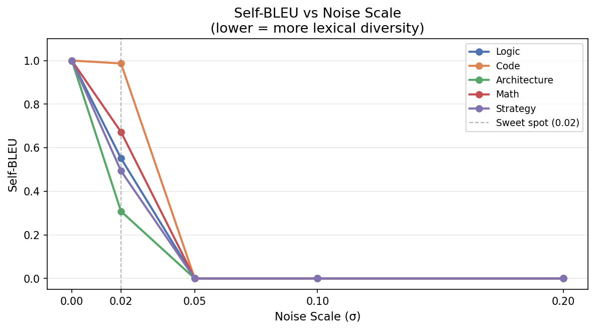
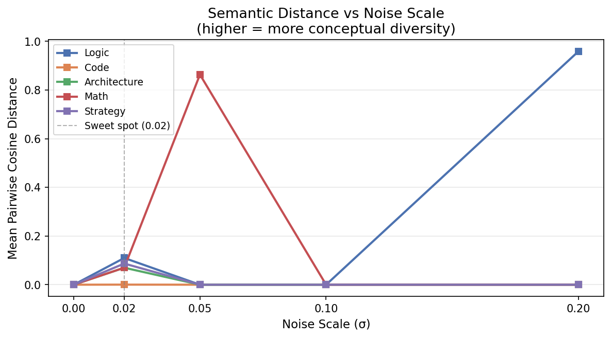
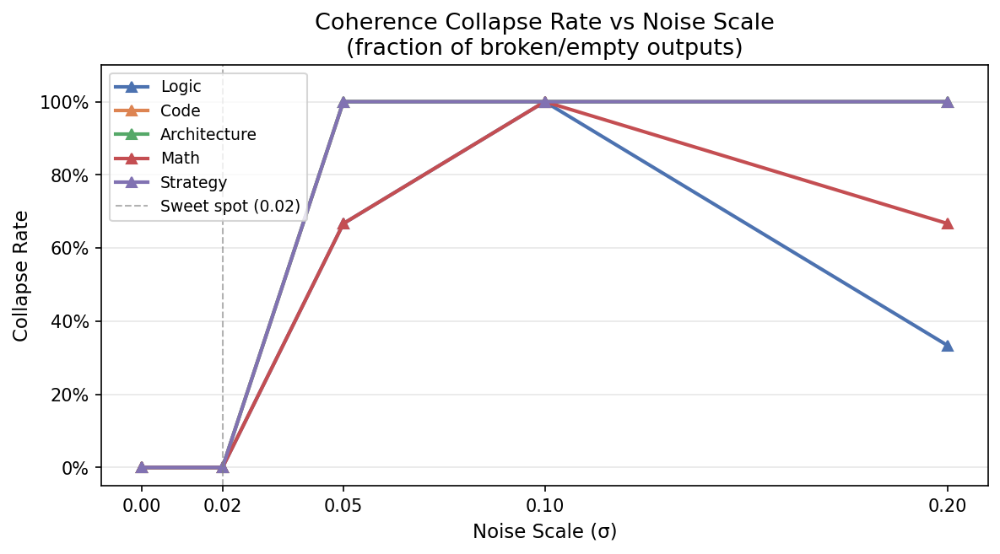

# Latent Noise Reasoning - A Latent Space Perturbation Experiment

## The Core Idea

There are two ways to make an LLM explore different solutions:
**Random Out** - standard temperature sampling. Randomness is applied token-by-token during generation. Every step is a dice roll. The problem: if one step goes wrong, every step after it is downstream of that mistake. Fatal errors compound.

**Random In** - inject Gaussian noise directly into the input embeddings *before* inference begins. The model then runs at temperature=0, fully deterministic after the initial perturbation. You get diverse starting conditions, but clean execution from each one.

These are structurally the same idea. These are just applied at different moments. Latent Space Perturbation is Temperature Annealing compressed to a single pre-token injection.

This experiment tests whether that distinction matters in practice.  

## Experiment Setup

| | |
|---|---|
| **Model** | `Qwen/Qwen2.5-7B-Instruct` |
| **Hardware** | Kaggle T4 × 2 (free tier) |
| **Problems** | 5 categories: Logic, Code, Math, Architecture, Strategy |
| **Noise scales** | 0.0, 0.02, 0.05, 0.1, 0.2 |
| **Trials per scale** | 3 |
| **Total outputs** | 80 |

**noise_scale = 0.0** is the clean deterministic baseline — no noise, temperature = 0, identical output every run.


## Metrics

**Self-BLEU** - measures how similar the 3 trial outputs are to each other at the word level.
Lower = more lexically diverse.

**Semantic Distance** - measures how far apart the 3 outputs are in meaning (via sentence embeddings).
Higher = more conceptually distinct.

**Coherence Collapse Rate** - fraction of outputs that are empty, too short, or clearly off-topic (language switch, gibberish).
Higher = the model broke.


## Results

```
     Problem  Noise_Scale  Self_BLEU  Semantic_Distance  Collapse_Rate
        Code         0.00     1.0000            -0.0000         0.0000
        Code         0.02     0.9869             0.0003         0.0000
        Code         0.05     0.0000             0.0000         1.0000
        Code         0.10     0.0000             0.0000         1.0000
        Code         0.20     0.0000             0.0000         1.0000
       Logic         0.00     1.0000             0.0000         0.0000
       Logic         0.02     0.5511             0.1098         0.0000
       Logic         0.05     0.0000             0.0000         0.6667
       Logic         0.10     0.0000             0.0000         1.0000
       Logic         0.20     0.0000             0.9586         0.3333
        Math         0.00     1.0000            -0.0000         0.0000
        Math         0.02     0.6724             0.0699         0.0000
        Math         0.05     0.0000             0.8632         0.6667
        Math         0.10     0.0000             0.0000         1.0000
        Math         0.20     0.0000             0.0000         0.6667
    Strategy         0.00     1.0000             0.0000         0.0000
    Strategy         0.02     0.4937             0.0869         0.0000
    Strategy         0.05     0.0000             0.0000         1.0000
    Strategy         0.10     0.0000             0.0000         1.0000
    Strategy         0.20     0.0000             0.0000         1.0000
Architecture         0.00     1.0000             0.0000         0.0000
Architecture         0.02     0.3082             0.0698         0.0000
Architecture         0.05     0.0000             0.0000         1.0000
Architecture         0.10     0.0000             0.0000         1.0000
Architecture         0.20     0.0000             0.0000         1.0000
```

**noise = 0.0** - All 3 trials are word-for-word identical. Self-BLEU = 1.0. The model is a fixed function.

**noise = 0.02** - Diversity appears. Self-BLEU drops, Semantic Distance rises. The model explores different phrasings and structures — but stays coherent. Collapse Rate = 0.0 across all categories. This is the sweet spot.

**noise = 0.05 and above** - Collapse begins. Most categories hit Collapse Rate = 1.0 by noise = 0.1. At noise = 0.2, Logic produces outputs in Chinese. Math outputs answer an entirely different question. The model has forgotten what it was asked.

**The Goldilocks Zone: noise = 0.02**

Too little noise → identical outputs, no exploration.  
Too much noise → the model forgets the question entirely.  
Just right (0.02) → genuine diversity, zero collapse.  


  

  
   


## Project Structure

```
latent-noise-reasoning/
├── experiment/
│   ├── experiment.py        # runs the perturbation experiment
│   └── analysis.py          # computes metrics and generates figures
├── results/
│   ├── latent_perturbation_results.csv    # raw model outputs (80 rows)
│   └── latent_experiment_summary.csv      # per-problem metrics
├── assets/
│   └── figures/             # generated charts
├── blog/
│   └── post.md              # full write-up
└── requirements.txt
```

```bash
git clone https://github.com/byGanesh/latent-noise-reasoning
cd  latent-noise-reasoning
pip install -r requirements.txt

# Run experiment (requires GPU)
python experiment/experiment.py

# Run analysis and generate figures
python experiment/analysis.py
```

> **Note:** `experiment.py` downloads `Qwen/Qwen2.5-7B-Instruct` (~15GB). A GPU with at least 16GB VRAM is recommended. The analysis script runs on CPU.


## Credits

- **Author:** [Ganesh Kumar](https://byganesh.com)  
- Experiment design inspired by [Dan Wood](https://www.linkedin.com/in/danwood1971/)'s post on the Random In / Random Out framing of Latent Space Reasoning.  
- Model: [Qwen2.5-7B-Instruct](https://huggingface.co/Qwen/Qwen2.5-7B-Instruct) by Alibaba Cloud
